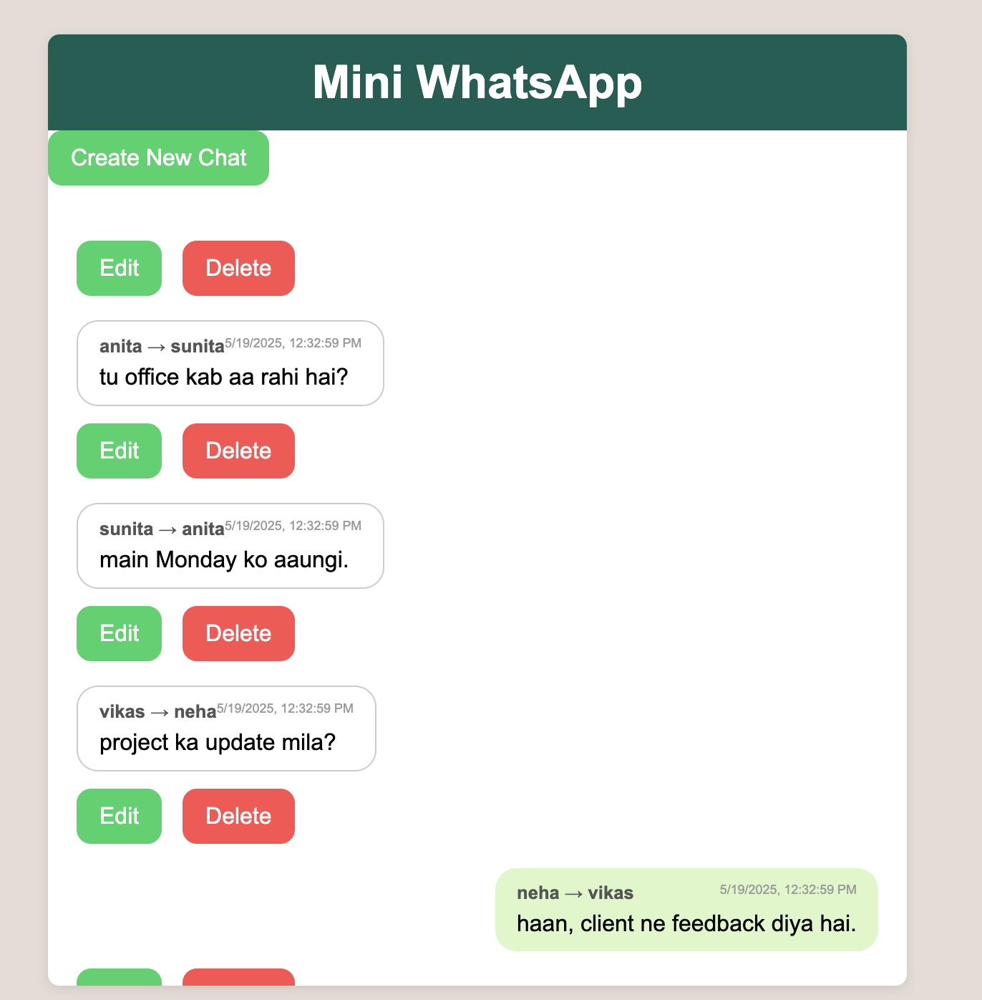

# 💬 Mini WhatsApp Clone

A mini WhatsApp-style chat app built using **Node.js**, **Express**, **MongoDB**, and **EJS**. Users can create, view, edit, and delete messages — mimicking basic chat functionality.

---

## 📸 Screenshot




---

## 🔧 Features

- 📝 Create new chat messages
- 📜 View all chat messages in WhatsApp-like UI
- ✏️ Edit existing messages
- ❌ Delete messages
- 🧼 Clean, WhatsApp-inspired frontend using CSS
- 🗃️ MongoDB for message storage

---

## 🛠️ Tech Stack

- **Backend**: Node.js, Express.js
- **Database**: MongoDB (Mongoose ODM)
- **Frontend**: EJS Templates, CSS
- **Utilities**: Method-Override for PUT/DELETE support

---

## 📦 Installation

### 1. Clone the repository

```bash
git clone https://github.com/your-username/mini-whatsapp.git
cd mini-whatsapp
````

### 2. Install dependencies

```bash
npm install
```

### 3. Start MongoDB

Make sure MongoDB is running locally:

```zsh
mongosh
```

> Or use a MongoDB Atlas connection string in `index.js`

### 4. Load dummy data

Optional: Seed the database using:

```bash
node init.js
```

This will insert pre-defined chat messages.

### 5. Run the app

```bash
node index.js
```

Visit: [http://localhost:8080/chats](http://localhost:8080/chats)

---

## 📁 Project Structure

```
mini-whatsapp/
├── models/
│   └── chat.js         # Mongoose schema
├── public/
│   └── styles.css      # CSS styling
├── views/
│   ├── chats.ejs       # Main chat view
│   ├── createChat.ejs  # Form to create a chat
│   └── edit.ejs        # Form to edit a message
├── init.js             # Dummy data seeder
├── index.js            # Main Express app
├── package.json
├── README.md
└── screenshots/
    └── demo.png        # UI screenshot
```

---

## 🧹 To Do

* Add search/filter by sender
* Add WebSocket for real-time updates
* Add user authentication and avatars

---

## 🙌 Author

Built by [Aayu Sehgal](https://github.com/sehgalaayu) to practice CRUD operations and basic styling.

---

## 📜 License

This project is licensed under the [MIT License](LICENSE).

```

